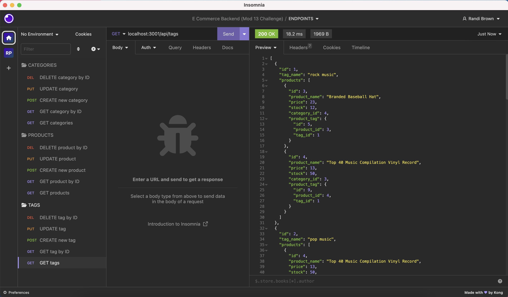

# E-Commerce Backend: Module 13 - ORM

## Description

This backend app for an e-commerce website uses `GET`, `POST`, `PUT` and `DELETE` routes on mock data to reproduce a backend for an actual e-commerce website. It uses `MySQL2` and `Sequelize` packages to connect our `Express.js` API to a `MySQL` database and the `dotenv` package to use environment variables to store sensitive data (in this case, my `MySQL` username, password, and database name).  
 
This application can serve to retrieve e-commerce data from the database, add to the database, update the database, and remove items from the database. It also uses `Sequelize` to create table models and relationships between models to easily interact with Javascript.

## Table of Contents

- [User Story](#user-story)
- [Acceptance Criteria](#acceptance-criteria)
- [Installation](#installation)
- [Usage](#usage)
- [Features](#features)

## User Story

AS A manager at an internet retail company  
I WANT a back end for my e-commerce website that uses the latest technologies  
SO THAT my company can compete with other e-commerce companies  

## Acceptance Criteria

GIVEN a functional Express.js API  
WHEN I add my database name, MySQL username, and MySQL password to an environment variable file  
THEN I am able to connect to a database using Sequelize  
WHEN I enter schema and seed commands  
THEN a development database is created and is seeded with test data  
WHEN I enter the command to invoke the application  
THEN my server is started and the Sequelize models are synced to the MySQL database  
WHEN I open API GET routes in Insomnia Core for categories, products, or tags  
THEN the data for each of these routes is displayed in a formatted JSON  
WHEN I test API POST, PUT, and DELETE routes in Insomnia Core  
THEN I am able to successfully create, update, and delete data in my database  

## Installation

For this application, you'll need `Node.js` and `MySQL` installed on your local machine. You need to run `npm install` to install all other dependencies from the `package.json`. Once you have all dependencies installed, you can move on to Usage.

## Usage

To use this app, please follow the instructions below:  
- First, add a `.env` file with your credentials to be able to connect to the server.  
- Login to your `MySQL Shell` and run `SOURCE db/schema.sql` to set up your database. You can quit your `MySQL Shell` after this command.  
- In your CLI, run `npm run seed` to seed your database with the mock data, or whatever data you'd like to add to those files.  
- Next, in your CLI, run `npm start` to start your server.  
- The backend is set up! You can test the routes in `Insomnia`. See walk-through demonstration of the routes in action below.  

Walk-through video on Google Drive: https://drive.google.com/file/d/19VKW08EhyhU4nkvucU0rjcJJZn-k5F9F/view  

https://github.com/randirose/e-commerce-backend-orm-randi/assets/128757891/e1af00a4-42eb-4bcf-b7e7-3a50413d0c85

****walk thru video embed link

  
  
  
  
  
  
  

## Features

- This application allows the user to retrieve (`GET` and `GET by ID`), create (`POST`), update (`PUT`), and remove (`DELETE`) content for a backend of an e-commerce website.  
- Using `Sequelize`, a model table is set up for each category, and a mapping table model (`ProductTag`) is set up for `through` relationships to be utilized when pulling data.
